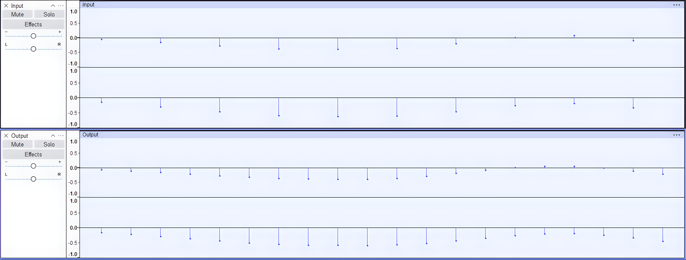
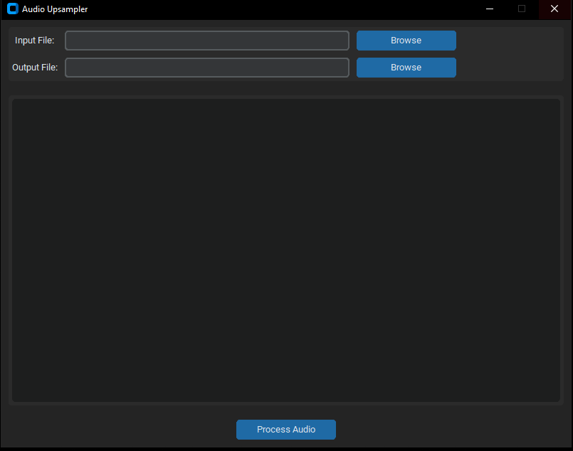

# Audio Upsampler

A Python application for upsampling audio files by inserting average amplitude samples between adjacent samples ending up with twice as much samples.



## Requirements
- Python 3.7+
- Libraries: `customtkinter`, `numpy`, `scipy`, `pydub`
- FFmpeg (for MP3 and FLAC support)

## Installation
1. Clone the repository:
   ```bash
   git clone https://github.com/PETROUNKNOWN/audioUpSampler.git

2. Install the required libraries:
    ```bash
    pip install customtkinter numpy scipy pydub

4. FFmpeg:
   - Windows:
      - Download FFmpeg from [FFmpeg.org](https://ffmpeg.org)
      - Extract the downloaded ZIP file.
      - Add the bin folder (inside the extracted FFmpeg folder) to your system's PATH:
        - Open the Start menu, search for "Environment Variables," and click "Edit the system environment variables."
        - In the System Properties window, click "Environment Variables."
        - Under "System variables," find the Path variable, click "Edit," and add the path to the bin folder (e.g., C:\ffmpeg\bin).
      - Restart your terminal or IDE to apply the changes.
    - Linux/macOS:
        - Install FFmpeg using your package manager:
          ```bash
          # For Ubuntu/Debian
          sudo apt install ffmpeg
          ```
          ```bash
          # For macOS (using Homebrew)
          brew install ffmpeg

## Note
- Supports `.wav`, `.flac`, and `.mp3` file formats.
- The resulting audio will be rendered with the original sample raate hence the output of this program will be slower.
- [Audacity](https://www.audacityteam.org/) can then be used to increase the sample rate from 44100HZ to 88200Hz which only Lossless formats support. FLAC is suggested.

## Screenshots



<!-- syndicat -->
